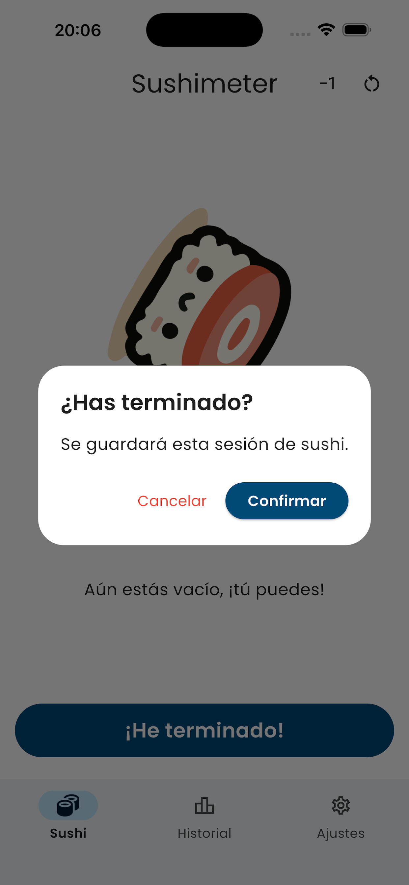
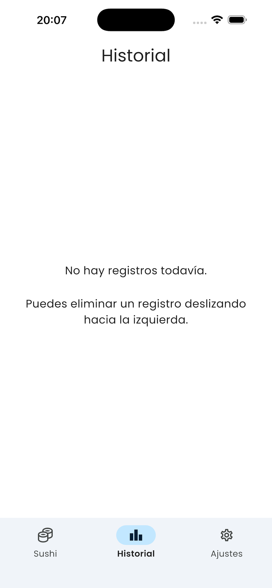

# 🍣 Sushimeter

**Sushimeter** es una aplicación móvil desarrollada en **Flutter** para contar las piezas de sushi que comes en cada sesión. Está diseñada para ser simple, rápida y divertida, con animaciones suaves y almacenamiento local.

<p align="center" style="font-size: 22px;">
  <a href="https://play.google.com/store/apps/details?id=com.samudev.dexhub">
    
  </a>
  &nbsp;&nbsp;&nbsp;&nbsp;
  <a href="https://apps.apple.com/app/id6757368640">
    
  </a>
</p>

---

## ✨ Características

- 🍱 Contador interactivo de piezas de sushi  
- 🔄 Animaciones suaves (rotación y efecto bounce)  
- 🧠 Frases dinámicas según el número de piezas  
- 🕒 Historial de sesiones con fecha y hora  
- 🗑️ Eliminar sesiones con *swipe to delete* y opción de deshacer  
- 🌙 Modo oscuro  
- 📦 Datos almacenados localmente (sin servidores)  
- 🔐 Sin recopilación de datos personales  

---

## 📸 Capturas de pantalla

<p align="center">
  
  
  
  
  
</p>

---

## 🚀 Tecnologías utilizadas

- Flutter  
- Dart  
- Hive – almacenamiento local  
- Provider – gestión de estado  
- tutorial_coach_mark – tutorial interactivo  
- Google Fonts  

---

## 📦 Instalación

### Requisitos
- Flutter SDK
- Android Studio o VS Code
- Xcode (para iOS)

### Pasos

```bash
git clone https://github.com/samudev4/sushimeter.git
cd sushimeter
flutter pub get
flutter run